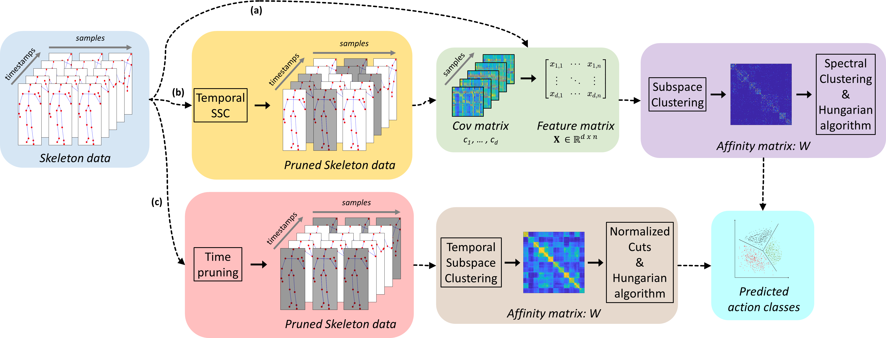

# Subspace Clustering for Action Recognition with Covariance Representations and Temporal Pruning

[](https://paperswithcode.com/sota/skeleton-based-action-recognition-on-msr-1?p=subspace-clustering-for-action-recognition)
[](https://paperswithcode.com/sota/skeleton-based-action-recognition-on-msrc-12?p=subspace-clustering-for-action-recognition)
[](https://paperswithcode.com/sota/skeleton-based-action-recognition-on-hdm05?p=subspace-clustering-for-action-recognition)
[](https://paperswithcode.com/sota/skeleton-based-action-recognition-on-msr?p=subspace-clustering-for-action-recognition)



This repository provides the supporting code for [our work](https://arxiv.org/abs/2006.11812) accepted to [ICPR 2020](https://www.micc.unifi.it/icpr2020/)

Code repository with demo script for the UTKinect dataset. /Data folder contains only the UTKinect dataset, to download and test other datasets, download the full package [here](https://1drv.ms/u/s!Ah-Dqjgf5l8LgnzpyjddphxusFjQ?e=j0ZAJ8).

## Requirements
+ [Ncut](https://www.cis.upenn.edu/~jshi/software/Ncut_9.zip): extract the files from the folder of the downloaded zip file into the /Ncut folder and follow the instructions contained into the *README.txt* file for a complete installation.
+ [SSC_ADMM](http://vision.jhu.edu/code/fetchcode.php?id=4): extract the files from the folder of the downloaded zip file into the /Codes_SSC folder.
+ [TSC](https://sites.google.com/site/lisheng1989/home/Publications/TSC_v1.zip?attredirects=0&d=1): extract the files from the "TSC/Codes" folder of the downloaded zip file into the /Codes_TSC folder.
+ *If you encounter issues on Ncut scripts, remove all files and, instead, use the ones provided inside the "TSC/Codes/ncut" folder.*
+ *If you encounter issues on normalize.m and plotClusters.m, remove both files from /Codes_TSC folder.*
+ [compacc.m](https://github.com/JLiangNKU/autoSC/blob/master/compacc.m): retireve the script [here](https://github.com/JLiangNKU/autoSC/blob/master/compacc.m) and put it into the /Codes_TSC folder.

The code has been runned on [MATLAB R2019b](https://it.mathworks.com/) and we therefore recommend this version.

For any questions, feel free to contact giancarlo.paoletti@iit.it

## Citation
 ```
@inproceedings{paoletti2020subspace,
    title={{Subspace Clustering for Action Recognition with Covariance Representations and Temporal Pruning}},
    author={Paoletti, Giancarlo and Cavazza, Jacopo and Beyan, Cigdem and Del Bue, Alessio},
    booktitle={25th International Conference on Pattern Recognition (ICPR)},
    year={2020},
}
 ```

## Disclaimer
The software is provided "as is", without warranty of any kind, express or implied, including but not limited to the warranties of merchantability, fitness for a particular purpose and noninfringement. In no event shall the authors, PAVIS or IIT be liable for any claim, damages or other liability, whether in an action of contract, tort or otherwise, arising from, out of or in connection with the software or the use or other dealings in the software.

## LICENSE
This project is licensed under the terms of the MIT license.

This project incorporates material from the projects listed below (collectively, "Third Party Code").  This Third Party Code is licensed to you under their original license terms.  We reserves all other rights not expressly granted, whether by implication, estoppel or otherwise.

1. [Shi, Jianbo, and Jitendra Malik. "Normalized cuts and image segmentation." IEEE Transactions on pattern analysis and machine intelligence 22.8 (2000): 888-905.](https://repository.upenn.edu/cgi/viewcontent.cgi?article=1101&context=cis_papers)
2. [Elhamifar, Ehsan, and Rene Vidal. "Sparse subspace clustering: Algorithm, theory, and applications." IEEE transactions on pattern analysis and machine intelligence 35.11 (2013): 2765-2781.](https://arxiv.org/pdf/1203.1005.pdf)
3. [Li, Sheng, Kang Li, and Yun Fu. "Temporal subspace clustering for human motion segmentation." Proceedings of the IEEE International Conference on Computer Vision. 2015.](https://openaccess.thecvf.com/content_iccv_2015/papers/Li_Temporal_Subspace_Clustering_ICCV_2015_paper.pdf)


